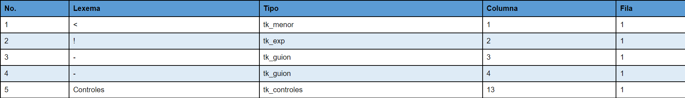
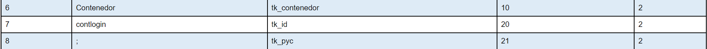
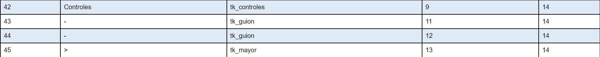
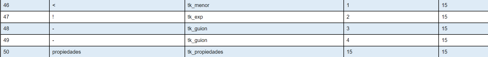
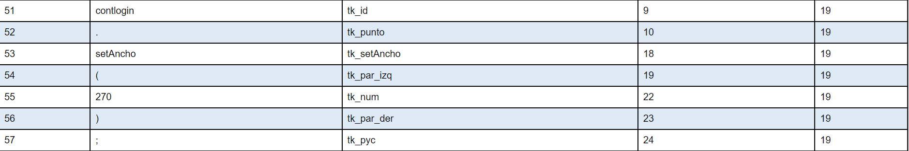
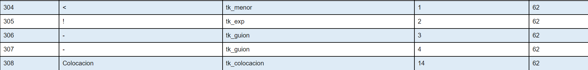
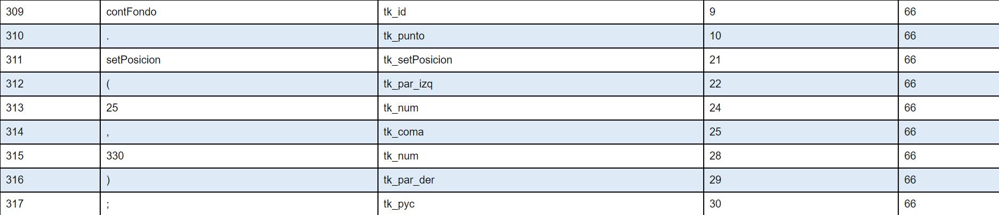
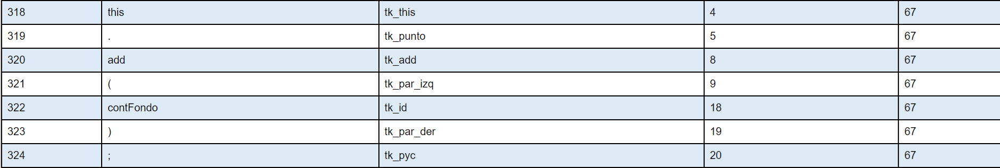
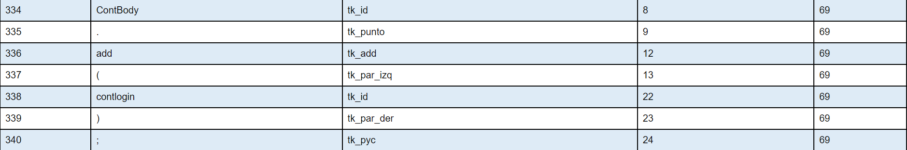
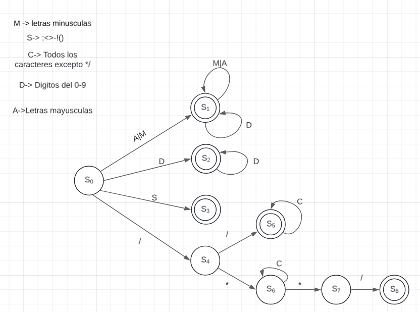

# Manual Técnico

Aplicacion desarrollada en:

* Frontend:
  * Python 3.12.2
* Backend:
  * GNU Fortran (tdm64-1) 10.3.0
  
## Backend

### Tabla de Tokens

La primer secuecia de caracteres de la tabla de tokens esta conformada por

la expresión regualar que hace posible este token es `[<][!][-]{2}Controles`, seguido a esta se encuentran los token de controles, los cuales definen los elementos del lenguaje. En forma general tiene la estructura:

Para cerrar la parte de controles se utiliza la expresión regular que hace posible esto es `[[A-Z][a-z]+ [[A-Z]|[a-z]]+;]+` creando la tabla

Se cierra el apartado de controles con la expresión `[Controles](-){2}>`.

Ahora se evalua el apartado de propiedades, en él se definen los tokens mediante la expresión `Control.propiedad(valor[,valor]*);`

Seguido a esto se definen las posiciones de los controles, con el token Colocacion, definido por `<!(-){2}Colocacion`

Luego puede aceptar cualquiera de las sigueintes estructuras:

Control.setPosicion(x, y);

this.add(ID);

Control.add(ID);

### AFD a través del método del árbol

### Analizador léxico

Para realizar el analizador léxico se apoyó en el Autómata Finito Determinista que produce el lenguaje

Como primer paso se realiza el analizador léxico del archivo de entrada, este se recibe desde el frontend de python con el código.

~~~FORTRAN
do
    read(*, '(A)', IOSTAT=ios) buffer
    if (ios /= 0) exit 
    contenido = trim(contenido) // trim(buffer) // new_line('a') 
end do
~~~

Esto permite concatenar toda la información que manda el frontend para ser tratada en el backend. Una vez concatenada la información se maneja en un ciclo case, en donde el caso 0, maneja las tabulaciones, los espacios en blanco y los saltos de línea, en caso de encontrar símbolos pertenecientes al lenguaje se manejarán en el caso 1, en caso de encontrar letras se manejará en el caso 2, en caso de ser un númeor se manejará en el caso 3, en caso contrario se manejará cómo un error léxico. Si fuera una barra diagonal se manejará en el caso 7, como un comentario.

~~~FORTRAN
len = len_trim(contenido)    
    do while(puntero <= len)
        char = contenido(puntero:puntero)
        select case (estado)
        case (0)
            if(ichar(char) == 47)then
                estado = 7
                columna = columna + 1
            elseif(any(char == S))then
                estado = 1
                columna = columna + 1
            elseif(any(char == A) .OR. any(char == M))then
                estado = 2
            elseif(char >= '0' .AND. char <= '9')then
                estado = 3
                elseif (char == '"')  then
                    aux_tkn = trim(aux_tkn) // char
                    columna = columna + 1
                    puntero = puntero + 1 
                    estado = 4       
                elseif (ichar(char) == 10) then
                    columna = 0
                    linea = linea + 1
                    puntero = puntero + 1
                elseif (ichar(char) == 9) then
                    columna = columna + 4
                    puntero = puntero + 1
                elseif (ichar(char) == 32) then
                    columna = columna + 1
                    puntero = puntero + 1  
                else
                    CALL agregar_error_lex(char, 'Error Lexico', linea,columna)
                    columna = columna + 1
                    puntero = puntero + 1
                    estado = 0
            end if
~~~

En el caso 1, dependiendo del símbolo se le asignará el token correspondiente con la subrutina `call agregar_token(char, token, linea, columna)` donde char es el caractér del token, token es el token que corresponde al símbolo, linea es la linea en la que se ubica y columna es la columna donde se ubica el token.

En el caso 2, se manejarán los tokens correspondientes a la estructura del lenguaje `call agregar_token(aux_tkn, 'tk_controles', linea, columna)`, en este caso se agregará al token el aux_tkn que corresponde a el lexema del token, en este ejemplo tk_controles corresponde al tipo de token que es el lexema, linea es la linea en la que se ubica y columna es la columna donde se ubica el token.
En el caso 3 se agrega el token correspondiente a un número.
Los casos 4 y 5 son correspondientes a cadena de texto, delimitadas por comillas `"`, esto crea el token cadena. De los casos 7 al 9, se manejan los comentarios, tanto los de línea, como los de más de una línea.
Una vez terminado el análisis léxico se llama a la subrutina parser, que es la encargada de realizar el análisis sintáctico.

### Analizador Sintáctico

El parser o analizador sintáctico valida que la estructura de los tokens sea la adecuada, según el lenguaje, para validar que se agreguen los controles necesarios se uriliza el códifgo

~~~FORTRAN
if(token_array(i)%tipo == 'tk_etiqueta')then
    if(token_array(i+1)%tipo == 'tk_id'&
        .AND. token_array(i+2)%tipo == 'tk_pyc')then
            call agregar_etiqueta(token_array(i+1)%lexema)
    else
            call agregar_error(token_array(i+1)%lexema, 'tk_id', token_array(i+1)%linea, token_array(i+1)%columna)
    end if 
end if
~~~

En este código, la única condición que cambia es la del primer if, dependiendo del token que es, se llama a las diferentes subrutinas de agregar, en este caso agrega la etiqueta al ser un token etiqueta, si fuera un token contenedor, se agregaría a la subrutina agregar_contenedor.

Una vez agregados los controles se pasa a validar las propiedades y las colocaciones, al compartir estructura inicial `ID.Condición` se valida esto con un ciclo if:

~~~FORTRAN
if (token_array(i)%tipo == 'tk_id' .and. token_array(i+1)%tipo == 'tk_punto' ) then
 !Condiciones 
end if
~~~

Seguido a esta se enlazan las condiciones necesarias para cada una de las propiedades, por ejemplo:

~~~FORTRAN
!Valida que sea una propiedad existente, en este caso setAncho
if(token_array(i+2)%tipo == 'tk_setAncho') then
!Valida que luego de la propiedad se abra un paréntesis
    if (token_array(i+3)%tipo .ne. 'tk_par_izq')then
        call agregar_error(token_array(i+3)%lexema, 'tk_par_izq', token_array(i+3)%linea, token_array(i+3)%columna)
!Valida que luego del paréntesis le siga un número
    elseif(token_array(i+4)%tipo .NE. 'tk_num')then
        call agregar_error(token_array(i+4)%lexema, 'tk_num', token_array(i+4)%linea, token_array(i+4)%columna)
!Valida que luego del número se cierre el paréntesis
    elseif(token_array(i+5)%tipo .NE. 'tk_par_der')then
        call agregar_error(token_array(i+5)%lexema, 'tk_par_der', token_array(i+5)%linea, token_array(i+5)%columna)
!Valida que al final se cierre con un punto y coma (;)
    elseif(token_array(i+6)%tipo .NE. 'tk_pyc')then
        call agregar_error(token_array(i+6)%lexema, 'tk_pyc', token_array(i+6)%linea, token_array(i+6)%columna)
!Si todo se cumple, es una propiedad efectiva y se agrega al control         
    else
        call etiqueta_set_Ancho(token_array(i)%lexema, token_array(i+4)%lexema)
    end if
end if
~~~

### Clases

El Backend está desarrollada en clases, cada clase se desarrolla en su propio archivo .f90, en él se puede editar el modulo , .MOD., de la clase, para poder utilizarlos en los demás archivos del backend se crea un objeto .o, esto se crea en la terminal con el comando `gfortran -c clase.f90`. Cada clase posee la estructura que simula una clase en fortran, en él se definen las propiedades del coontrol.

~~~FORTRAN
type :: Tag
    CHARACTER(LEN=50) :: id
    CHARACTER(LEN=20) :: tipo
    CHARACTER(LEN=20) :: alto 
    CHARACTER(LEN=20) :: ancho
    CHARACTER(LEN=200) :: texto 
    CHARACTER(LEN=50) :: alineacion
    CHARACTER(LEN=50) :: posicion_x
    CHARACTER(LEN=50) :: posicion_y
    CHARACTER(LEN=50) :: grupo
END TYPE Tag
~~~

En cada archivo se tiene la subrutina para agregar el control:

~~~FORTRAN
!Si el arreglo no está alojado en la memoria crea una posición del arreglo
if(.NOT. ALLOCATED(texto_array))then
    ALLOCATE(texto_array(1))
    texto_array(1) = nuevo_texto
!En caso contrario crea un nuevo espacio del arreglo
else
    n = SIZE(texto_array)
    ALLOCATE(temp_array(n+1))
    temp_array(:n) = texto_array
    temp_array(n+1) = nuevo_texto
    DEALLOCATE(texto_array)
    ALLOCATE(texto_array(n+1))
    texto_array = temp_array
endif
~~~

Además tiene las subrutinas necesarias para agregar cada una de las propiedades. Cada subrutina recibe el id y la propiedad como parámetro, en este caso el texto. Para agregar la propiedad se utiliza el ID, con el que se identifica cada uno de los controles, para ello se busca el ID en el arreglo de la propiedad y al encontrarlo verifica si existe, si no regresa al parser y no hace nada, en caso de encontrarlo cambia la propiedad que se solicita.

~~~FORTRAN
subroutine texto_set_texto(id, texto)
    !Verifica si la memoria ha sido asignada para el arreglo
    if (.NOT. ALLOCATED(texto_array)) then
        return
    else
        DO i = 1, size(texto_array)
            if (trim(texto_array(i)%id) == id) then
                texto_array(i)%texto = texto
            end if
        END DO
    end if
end subroutine texto_set_texto
~~~

## Salida

La clase Salida es la encargada de convertir el texto de entrada en un archivo html. Para ello, Fortran crea un archivo salida.html, en él escribirá las caracteristicas del archivo de entrada.

~~~FORTRAN
open (unit=file_unit, file="..\Out\Salida.html", status="replace", action="write", iostat=ios)
    if(ios /= 0)then
        print *, "Errar al abrir el archivo"
    else
~~~

Primero se escribe la estructura de todos los archivos html, seguido del enlace al archivo css.

~~~FORTRAN
write(file_unit, '(A)') '<!DOCTYPE html>' // NEW_LINE('A')
        write(file_unit, '(A)') '<html><head>' &
         // '<title>Salida</title>' &
         // '<link rel="stylesheet" type="text/css" href="Salida.css">' &
         // '</head><body>' // NEW_LINE('A')
~~~

Luego con un ciclo DO se recorre para escribir los contenedores con el grupo de body, para que puedan ser los contenedores padre de los demás controles.

~~~FORTRAN
DO i = 1, size(contenedor_array)
                !Si el grupo del contenedor es el grupo body, se crea el div en el body    
                if(contenedor_array(i)%grupo == 'body')then
                    write(file_unit, '(A)') '
'&
                    // NEW_LINE('A')
~~~

Luego se recorre un nuevo ciclo Do, esto para verificar si existen contenedores hijo del contenedor padre de ese moemtno.

~~~FORTRAN
  DO j = 1, size(contenedor_array) 
        if(contenedor_array(i)%id ==contenedor_array(j)%grupo)then
            write(file_unit, '(A)') '
' // NEW_LINE('A')
~~~

Luego, se recorre un último ciclo DO, esto para corroborar si existen elementos dentro de este contenedor, en él se recorren todos los arreglos de los contenedores, parqa este ejemplo se recorre el arreglo de etiquetas.

~~~FORTRAN
            DO z = 1, size(etiqueta_array)
                if(contenedor_array(j)%id==etiqueta_array(z)%grupo)then
                write(file_unit, '(A)') '<label id="' &
                    // trim(etiqueta_array(z)%id) // '">' & 
                    // trim(etiqueta_array(z)%texto) & 
                    // '</label>' // NEW_LINE('A')
                end if
            END DO
~~~

Una vez recorridos todos los arreglos, se cierra el documento y se llama a la subrutina que crea el archivo .css para los stilos del html.

CSS:
Primero se escriben las lineas que todo archivo css posee, luego co un ciclo DO, se recorre cada arreglo que posee las instrucciones, utilizando un #, para indicar que se base en el ID para los estilos, seguido se imprime el ID del elemento, luego se abre un corchete "{", indicando que se escribiran los estilos del control. Luego de escribir todos los estilos, se pasa al sigueinte arreglo hasta tener toda la información de los estilos.

~~~Fortran
open (unit=file_unit, file="..\Out\Salida.css", status="replace", action="write", iostat=ios)
        if(ios /= 0)then
            print *, "Errar al abrir el archivo"
        else
    DO i = 1, size(etiqueta_array)
        write(file_unit, '(A)') '#' // trim(etiqueta_array(i)%id) // '{' // NEW_LINE('A')
        write(file_unit, '(A)') 'position:absolute;' // NEW_LINE('A')
        write(file_unit, '(A)') 'top:' // trim(etiqueta_array(i)%posicion_y) // 'px;' // NEW_LINE('A')
        write(file_unit, '(A)') 'left:' // trim(etiqueta_array(i)%posicion_x) // 'px;' // NEW_LINE('A')
        write(file_unit, '(A)') 'width:' // trim(etiqueta_array(i)%ancho) // 'px;' // NEW_LINE('A')
        write(file_unit, '(A)') 'height:' // trim(etiqueta_array(i)%alto) // 'px;' // NEW_LINE('A')
        write(file_unit, '(A)') 'color:rgb('&
        // trim(etiqueta_array(i)%color_texto_r)// ',' &
        // trim(etiqueta_array(i)%color_texto_g)// ',' &
        // trim(etiqueta_array(i)%color_texto_b)// ');' // NEW_LINE('A')
        write(file_unit, '(A)') 'font-size: 12px;' // NEW_LINE('A')
        write(file_unit, '(A)') '}'
    END DO
~~~

## Frontend

Aplicación desarrollada con la libreria tkinter.

Dentro de la ventana se crea un widget Frame, que será el encargado de contener los widgets de la aplicación. Con la propiedad de `Frame_F.grid()` se hace que todos los widgets de la aplicación se empqueten como posiciones una tabla.

### Área de entrada

Compuesto por un textarea, donde el usuario podrá editar texto para su análisis y una scrollbar para que pueda navegar con mayor facilidad.

~~~PYTHON
TxtBox_E = Text(Frame_F, wrap=NONE)
TxtBox_E.grid(row=0, column=0, sticky="nsew")

scroll = Scrollbar(Frame_F)
scroll.grid(row=0, column=1, sticky="ns")
scroll.config(command=TxtBox_E.yview)
TxtBox_E.config(yscrollcommand=scroll.set)    
~~~

Con el botón para analizar el contenido del text area, se ejecutará la función Analizar(), que enviará la información al Backend para su análisis.

~~~PYTHON
def Analizar():
    # Obtener el contenido del área de texto 
    data = TxtBox_E.get("1.0", END)
    resultado = subprocess.run(
        ["..\Backend\main.exe"],  # Ejecutable de Fortran
        input=data,  # la data que se manda a Fortran
        stdout=subprocess.PIPE,  # la data que viene de Fortran   
        text=True  # la salida se maneja como texto
    )  
~~~

Es posible enlazar a un backend en fortran con la libreria Subprocess, esta envia y recibe información del archivo de fortran, es posible manejar la información a través de `output = resultado.stdout.strip()`. En caso de encontrar errores, el backend mandará los mismos al frontend para poder ser mostrados al usuarios. Para ser mostrados se agregarán a la tabla de errores con un ciclo for, agregando los 5 datos del error a cada línea de la tabla.

~~~PYTHON
    output = resultado.stdout.strip()         
    datos = output.split(' ')
    
    Tabla_E.delete(*Tabla_E.get_children())
    filas_unicas = set()
    if len(datos) == 1:
         messagebox.showinfo("Información", "No se encontraron errores")
         return
    else:
        for i in range(0, len(datos), 5):
            fila = (datos[i], datos[i+1], 
            datos[i+2], datos[i+3], datos[i+4])
~~~

Con la librería `webbrowser` es posible abrir archivos en el navegador del usuario. Para ello se utiliza un try-cath, para intentar abrir el archivo, y en caso de no ser posible, se le mostrará al usuario el error.

~~~Python
try:
        webbrowser.open(r"..\Out\tokens.html")
    except Exception as e:
        messagebox.showerror("Error: ", f"Error al abrir el archivo: {e}")
~~~

Es importante empaquetar `.pack()` cada elemento a mostrar, y terminar con un comando `Principal.mainloop()` para que la aplicación se ejecute sin ningún error.
