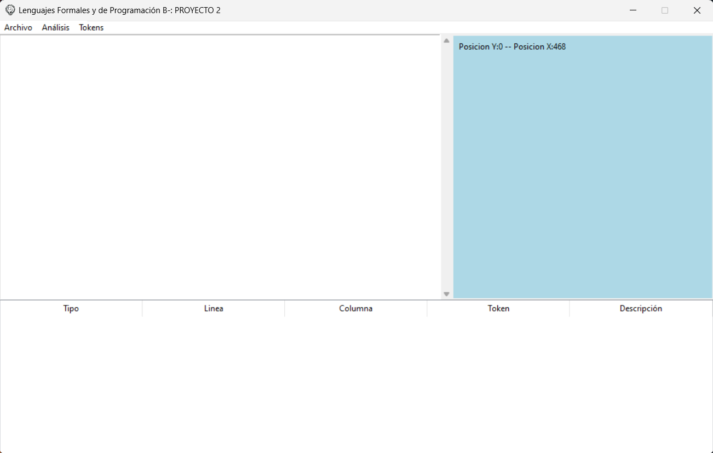

# Manual de Usuario

Al iniciar la aplicacion se mostrará la ventana:


Esta dispone de 4 áreas prinicipales:

## Menu

Acá se mostrarán las opciones que la aplicación puede realizar

* Archivo:
  * Nuevo
  Su función es la de crear un nuevo archivo para editar, si hay uno abierto en ese momento se preguntará al usuario si desea guardar el archivo que se esta editando en ese momento, si asi se desea se abrirá una ventana para guardar el archivo en la ubicación y nombre que se desee.
  * Abrir
  Al seleccionar el botón abrir se desplegará una ventana emergente del gestor de archivos, en él se podrá seleccionar el archivo que se quiere analizar. Dicho archivo debe tener extensión .LFP.
  * Guardar
  Este botón tiene la funcionalidad de guardar la información del área de edición en el mismo archivo que se ha abierto para editar. En caso de no haber abierto ningún archivo se desplegará una ventana del gestor de archivos para guardar la información del editor de texto en un nuevo documento con extensión predetrminada de .LFP.
  * Guardar como: Permite guardar la información del área de texto en un nuevo documento con el nombre que se desee, la extensión predeterminada será .LFP.
  * Salir
   La funcionalidad de este botón es de salir de la aplicación, al seleccionarse se desplagará un mensaje emergente en el que se pregunte si se desea salir de la misma, si se selecciona "Sí" se cerrará, si se selecciona "No" se cierra la ventana emergente y se puede seguir trabajando con normalidad.

* Análisis
  Al clickear esta opción del menú se realizará el análisis del texto que se encuentre en el área de entrada. En caso de encontrar errores se mostrarán en el área de errores, si no existen errores se desplegará un mensaje emergente que indica que no se encuentran errores y se creará el archivo de salida con las instrucciones del archivo de entrada.
* Tokens
  Esta opción del menú, abrirá el archivo que contiene la información de los tokens encontrados en el archivo de entrada.

## Área de entrada

Se encuentra en el lado izquierdo de la venta y se encuntra delimitado por un cuadrado blanco. Acá se mostrará y se podrá editar el texto del documento cargado para su análisis, o si se desea, se puede escibir en él sin la necesidad de cargar un archivo previo. El texto a analizar debe tener la siguiente estructura:

```Text
<!--Controles
    Control ID;
Controles -->
```

Donde:

* `Control`: Es una de las etiquetas permitidas por el lenguaje (Contenedor, Boton, Etiqueta, etc.).
* `ID`: Es el id con el que se identifica al control, este servirá para dar instrucciones en el área de propiedades y de colocación.

```Text
<!--propiedades
    Control.propiedad( valor[, valor]* );
propiedades -->
```

Donde:

* `Control`: Es el ID definido en el área de controles.
* `propiedad`: Es la propiedad que le queremos agregar al id, como cambiarle el color de letra o el color de fondo.
* `valor`: Es el valor de la propiedad, algunas propiedades aceptan más de un valor, este debe ir separado por coma y finalizado por el cierre de paréntesis.

```Text
<!--Colocacion
    Control.setPosicion(x, y);
    Control.add(ID);
    this.add(ID);
Colocacion-->
```

Donde:

* `Control.setPosicion(x, y);`: Esta instruccion debe tener un Id colocado en el apartado de Control, la instrucción setPosicion acepta 2 valores numéricos separados por comas, y dará la posicion del control en el archivo de salida.
* `Control.add(ID);`: Esta instrucción especifica el nombre del control que será posicionado dentro de otro Control. El primer control es el ID del control padre y el que se encuentra dentro de los paréntesis es el del control hijo.
* `this.add(ID);`: En este caso el ID no está contenido dentro de otro control, sino dentro de la página exactamente.

## Posición del mouse

Se encuentra en el área derecha de la ventana y proporciona información acerca de donde se encuentra el mouse, dentro del área de entrada. Esta posición ayuda a localizar errores existentes en el archivo de entrada.

## Tabla de errores

En caso de existir errores en el archivo de entrada se mostrarán en la tabla, ubicada en el área inferior de la ventana. En esta tabla se mostrará la información necesaria para encontrar el error y poder corregirlo.
